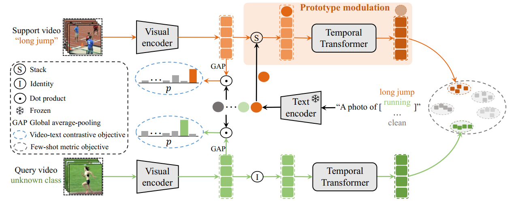

# CLIP-guided Prototype Modulating for Few-shot Action Recognition (IJCV-2023)
### Official Pytorch Implementation of [CLIP-FSAR](https://arxiv.org/pdf/2303.02982.pdf)



> **CLIP-guided Prototype Modulating for Few-shot Action Recognition**<br>
> Xiang Wang · Shiwei Zhang · Jun Cen · Changxin Gao · Yingya Zhang · Deli Zhao · Nong Sang
>
>
<!-- > [Paper](https://arxiv.org/pdf/2303.02982.pdf) -->
>
>
> **Abstract:** *Learning from large-scale contrastive language-image pre-training like CLIP has shown remarkable success in a wide range of downstream tasks recently, but it
is still under-explored on the challenging few-shot action
recognition (FSAR) task. In this work, we aim to transfer the powerful multimodal knowledge of CLIP to alleviate the inaccurate prototype estimation issue due to data
scarcity, which is a critical problem in low-shot regimes. To
this end, we present a CLIP-guided prototype modulating
framework called CLIP-FSAR, which consists of two key
components: a video-text contrastive objective and a prototype modulation. Specifically, the former bridges the task
discrepancy between CLIP and the few-shot video task by
contrasting videos and corresponding class text descriptions.
The latter leverages the transferable textual concepts from
CLIP to adaptively refine visual prototypes with a temporal Transformer. By this means, CLIP-FSAR can take full
advantage of the rich semantic priors in CLIP to obtain reliable prototypes and achieve accurate few-shot classification.
Extensive experiments on five commonly used benchmarks
demonstrate the effectiveness of our proposed method, and
CLIP-FSAR significantly outperforms existing state-of-the-art methods under various settings.*


This code is based on [pytorch-video-understanding](https://github.com/alibaba-mmai-research/TAdaConv) codebase, which provides a comprehensive video understanding solution for video classification and temporal detection. 

## Installation

Requirements:
- Python>=3.6
- torch>=1.5
- torchvision (version corresponding with torch)
- simplejson==3.11.1
- decord>=0.6.0
- pyyaml
- einops
- oss2
- psutil
- tqdm
- pandas

optional requirements
- fvcore (for flops calculation)

Or you can create environments with the following command:
```
conda env create -f environment.yaml
```

## Data preparation

First, you need to download the datasets from their original source (If you have already downloaded, please ignore this step
):

- [SSV2](https://20bn.com/datasets/something-something#download)
- [Kinetics](https://github.com/Showmax/kinetics-downloader)
- [UCF101](https://www.crcv.ucf.edu/data/UCF101.php)
- [HMDB51](https://serre-lab.clps.brown.edu/resource/hmdb-a-large-human-motion-database/#Downloads)

Then, prepare data according to the [splits](configs/projects/MoLo) we provide.

## Running
The entry file for all the runs are `runs/run.py`. 

Before running, some settings need to be configured in the config file. 
The codebase is designed to be experiment friendly for rapid development of new models and representation learning approaches, in that the config files are designed in a hierarchical way.

For an example run, open `configs/projects/CLIPFSAR/kinetics100/CLIPFSAR_K100_1shot_v1.yaml`

A. Set `DATA.DATA_ROOT_DIR` and `DATA.DATA_ANNO_DIR` to point to the kinetics dataset, 

B. Set the valid gpu number `NUM_GPUS`

Then the codebase can be run by:
```
python runs/run.py --cfg configs/projects/CLIPFSAR/kinetics100/CLIPFSAR_K100_1shot_v1.yaml
```

## Citation
If you find this code useful, please cite our paper.

~~~~
@article{wang2023clip,
  title={CLIP-guided Prototype Modulating for Few-shot Action Recognition},
  author={Wang, Xiang and Zhang, Shiwei and Cen, Jun and Gao, Changxin and Zhang, Yingya and Zhao, Deli and Sang, Nong},
  journal={International Journal of Computer Vision (IJCV)},
  year={2023}
}
~~~~
